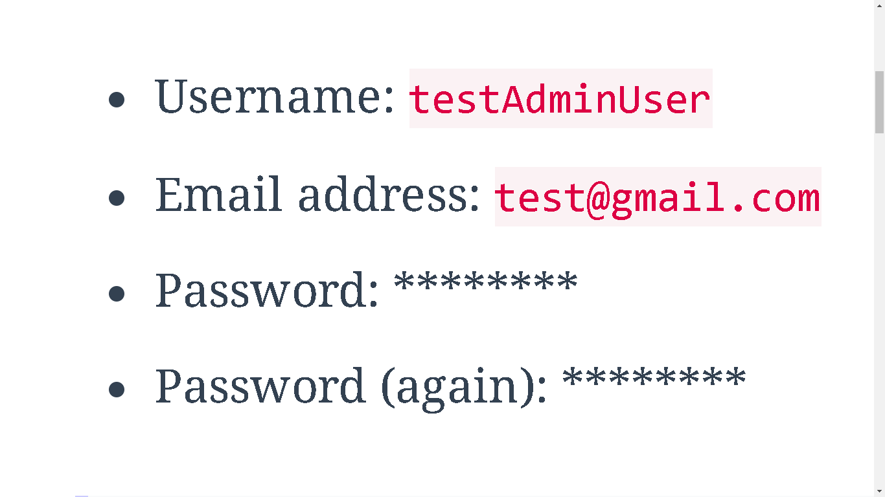

> # GARDENSHARE
---------------------------------------
> # CONFIGURACION BACKEND

Este proyecto backend esta desarrollado con las tecnologias Python 3.10+, **[Django](https://www.djangoproject.com/)**,
base de datos **Sqlite**, [...]() para gestión de imagenes, y documentación de API
con Swagger ([drf-yasg - Yet another Swagger generator](https://drf-yasg.readthedocs.io/en/stable/readme.html)). Su
despliegue remoto se llevo a cabo en [pythonanywhere.com](https:www.pythonanywhere.com)
bajo el contenedor [...].

> ## Uso Local
Para uso local se emplearán las herramientas listadas en los archivos [requirements.txt](requirements.txt),
o [pyproject.toml](pyproject.toml). Las configuraciones requeridas para iniciar este proyecto en ambiente local se irán
desarrollando en apuntes mas adelante.

Cabe mencionar que la gestión de paquetes del entorno python se hará con el paquete [Poetry](https://pypi.org/project/poetry/)

### Requisitos previos

* Tener instalado [Python 3.10+](https://www.python.org/downloads/)
* Instalar [Poetry](https://pypi.org/project/poetry/).

_Nota: Omitir los pasos anteriores si tiene instaladas estas dos herramientas_

### Preparar entorno

* Clona el proyecto con el siguiente comando
````sh
git clone https://github.com/No-Country/s14-23-m-python
````

* Crea un archivo `.env` donde se guardan las siguientes variables de entorno, guardalo en la actual carpeta, `backend`.
  * _Solicita las variables a alguno de los miembros del equipo backend_. Se empleará una secret key por medio del metodo *_get_random_secret_key_* desde *_django.core.management.utils_*

* Configuración **[Poetry](https://pypi.org/project/poetry/)**

Instala Poetry, desde local, con el siguiente comando:

> 📝 **Note:** Evita ejecutar `python -m venv venv` o algún comando similar, Poetry se encargara de gestionar entorno y paquetes.

```
pip install poetry
```

* Una vez instalado **Poetry**, ejecuta el siguiente comando en la terminal:
````sh
poetry --version
````


_Nota: La versión puede cambiar al momento de instalar_

* Agrega la siguiente configuracion en la terminal,

```sh
poetry config virtualenvs.in-project true
```

* Inicia el entorno virtual con el comando:

````sh
poetry shell
````

* A continuación, instala las dependencias:

```sh
poetry install
```

### Configuración de Pre-commit
[Pre-commit](https://pre-commit.com/) es un marco para gestionar y mantener enlaces de confirmación previa en varios lenguajes.

> _"Git hook scripts are useful for identifying simple issues before submission to code review. We run our hooks on every
commit to automatically point out issues in code such as missing semicolons, trailing whitespace, and debug statements"_

* Ejecuta el siguiente comando para configurar el paquete **pre-commit**:

```sh
poetry run pre-commit install
```

### Iniciar el servidor

Si es la primera vez que descargas el repositorio, es muy importante que realice las migraciones de los diferentes
modelos, vistas y conectores para la creación/registro de datos en la base de datos.

* Ejecutar migraciones

````sh
python manage.py makemigrations
python manage.py migrate
````
* Crear usuario Administrador (super usuario)

````sh
python manage.py createsuperuser
````

Debes completar información basica:



* Levantar el servidor de Django.

```sh
python manage.py runserver
```
> #### Uso general:
> Una vez configurado el repositorio de manera local, para las siguientes pruebas solo debes seguir los
> pasos de activar entorno, instalar dependencias (verificar paquetes instalados) y levantar servidor.
>
> Opcional: Ejecutar migraciones, siempre y cuando al levantar el servidor lo indique o se hayan generado cambios en la
> base de datos respecto a las relaciones o modelos.
>
> ###### Pasos:
> 1) ```poetry shell```
> 2) ```poetry install```, de ser requerido para verificar nuevos paquetes
> 3) ```python manage.py makemigrations``` *_opcional_
> 4) ```python manage.py migrate```, *_opcional_
> 5) ```python manage.py runserver```


> ## Uso remoto

Accede al enlace donde se despliega el entorno backend. En esta ocasión se implementó el entorno de
[pythonanywhere](https://www.pythonanywhere.com/):

* Cliquea https://s1319mpython.pythonanywhere.com/ para acceder a los diferentes endpoints que se desarrollarón para
ejecutar las distintas peticiones desde la interfaz de frontend.

> ## Endpoints desarrollados


> ## Equipo

El proyecto de backend fue desarrollado por el siguiente talento:


| Talento                | Github                                              | Linkedin                                                                 |
|------------------------|-----------------------------------------------------|--------------------------------------------------------------------------|
| [Crispthofer Rincon]() | [CrispthoAlex](https://github.com/CrispthoAlex)     | [carmurrain](https://www.linkedin.com/in/carmurrain)                     |
| []()  | [](https://github.com/)           | [](https://www.linkedin.com/in/)                                 |
| []()       | [](https://github.com/) | [](https://www.linkedin.com/in/)             |
